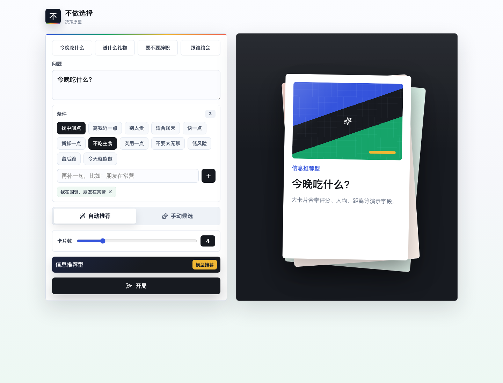
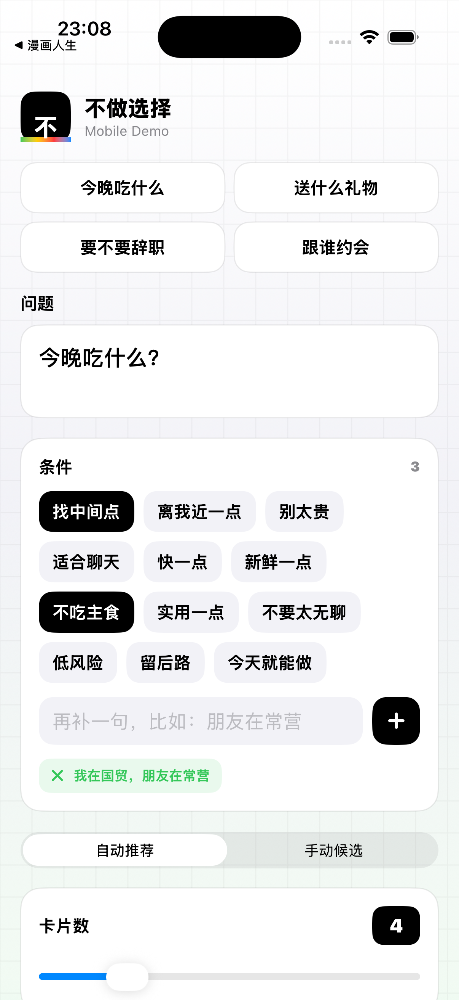
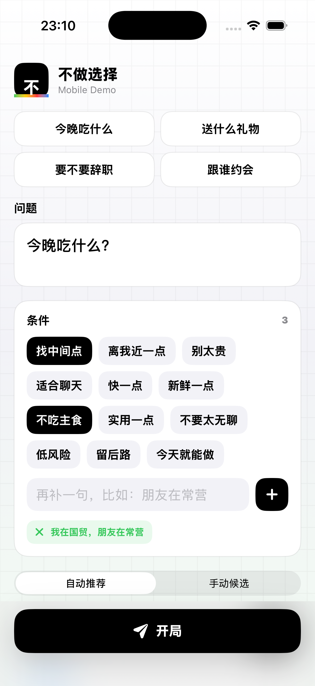
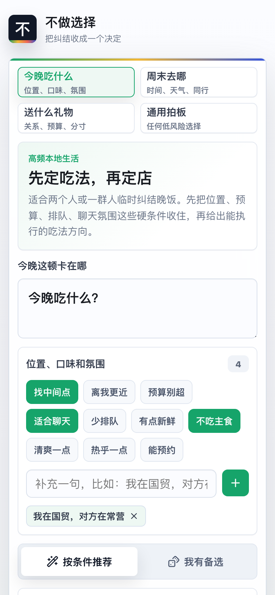
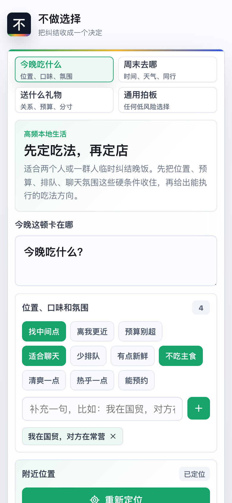
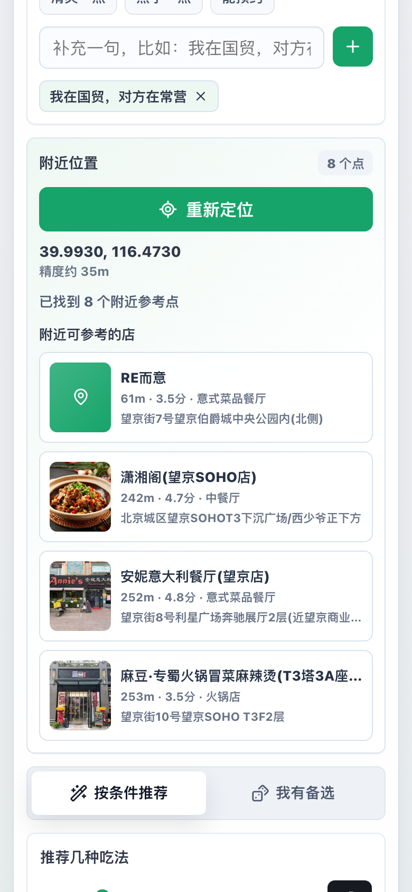
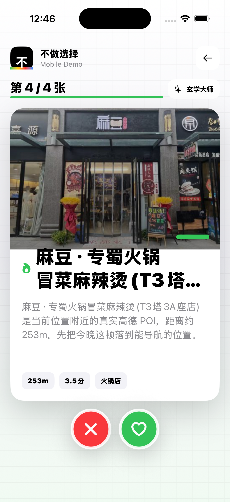

# 不做选择 No Choice

不做选择是一个替高频日常选择快速拍板的决策原型：用户输入问题和偏好条件，系统生成候选卡片，让你短暂滑动比较后给出一个明确、可执行的结论。

当前版本深入做了四个模块：今晚吃什么、周末去哪、送什么礼物，以及一个通用拍板模块。产品目标不是替用户做严肃决策，而是把低风险、高摩擦的日常选择快速推进到行动。

## Demo

- 手机优先演示：https://no-choice.pages.dev/
- GitHub Pages 镜像：https://hpuxyh.github.io/no-choice/
- 本地 demo 网站：http://127.0.0.1:5173/

## 核心体验

- 快速建局：预设常见选择困难场景，也支持自己输入问题。
- 条件收集：用标签和补充输入记录偏好、约束和临时想法。
- 自动推荐：根据问题类型和条件生成候选卡片。
- 滑卡拍板：用户可以滑动比较，但滑到底会兜底给出最终选择。
- 直接结论：是否题会直接给出“做/不做”判断和理由。
- 解释口吻：支持不同风格的推荐理由，降低“被算法命令”的生硬感。
- 手机定位：吃饭和周末模块支持点击获取当前位置；吃饭模块在 Cloudflare 版通过 `/api/poi` 拉取附近真实餐厅、距离、评分、地址和店铺图。

## Modules

- 今晚吃什么：围绕位置、口味、预算、排队和聊天氛围做推荐；配置高德 Web 服务 Key 后会优先使用当前位置附近的真实餐厅 POI 和图片。
- 周末去哪：围绕时长、天气、体力和同行关系，把周末压成一段可执行的小行程。
- 送什么礼物：围绕关系、预算、实用性和踩雷风险，推荐更容易买、也更得体的礼物。
- 通用拍板：处理暂时还没垂直化的问题，比如选方案、买不买、今天先做什么。

## Screenshots

### Web Prototype



### iOS Prototype

<p>
  
  
  
  
  
  
</p>

## Project Structure

- `no-choice-demo/`：React + Vite 网页版原型
- `NoChoiceMobile/`：SwiftUI 原生 iOS 原型
- `screenshots/`：演示截图
- `.github/workflows/deploy-demo.yml`：GitHub Pages 自动部署流程

## Web Demo

```bash
cd no-choice-demo
npm install
npm run dev
```

构建：

```bash
cd no-choice-demo
npm run build
```

## iOS Demo

```bash
xcodebuild -project NoChoiceMobile/NoChoiceMobile.xcodeproj -scheme NoChoiceMobile -configuration Debug -destination 'platform=iOS Simulator,name=iPhone 17' build
```

## Current Scope

- 大模型推荐暂时用本地规则和候选池模拟。
- 餐厅和地点候选在未配置地图 Key 时仍使用策略/类别示例；配置 `AMAP_WEB_SERVICE_KEY` 后可返回真实附近 POI。
- 当前重点是验证“少比较、快拍板”的交互节奏。

## API Plan

当前版本已经接入高德 POI 作为吃饭模块的第一条真实数据链路。要继续做成真正可用的产品，接口优先级建议如下：

1. 位置和 POI：吃饭模块优先级最高，周末模块次之。当前已支持当前位置、附近餐厅、距离、评分、地址和图片；下一步可以补营业时间、价格、人均、导航跳转和“我与朋友的中点”。
2. 天气和活动：周末模块建议接天气、展览/演出/体验活动或票务数据，用来判断室内外、雨天备用和预约可行性。
3. 电商和商品搜索：礼物模块适合接商品搜索、价格、库存、配送时效和图片。前期可以只做跳转，先不做站内交易。
4. 大模型：适合生成候选、解释推荐理由、把用户自然语言条件转成结构化筛选项。API key 不应该放在前端，需要后端或 Serverless 代理。
5. 图片：真实地点优先用 POI 返回的店铺图，礼物优先用商品图；没有真实数据时，用固定素材或图片 API 做氛围图即可。
6. 用户输入兜底：必须保留。位置权限可能被拒绝，POI/商品也可能无结果，所以始终允许用户手动输入城市、商圈、候选项和限制。

## POI Setup

Web 手机端定位使用浏览器 Geolocation，原生 iOS 使用 CoreLocation，二者都只在用户点击定位按钮后触发。真实 POI 查询走 Cloudflare Pages 的 `/api/poi` 代理，避免把地图 Web 服务密钥暴露在前端或 App 包里。

需要提供并配置：

1. 高德开放平台 Web 服务 API Key。
2. 在 Cloudflare Pages 项目环境变量里设置 `AMAP_WEB_SERVICE_KEY`。
3. 重新部署 Cloudflare Pages。

GitHub Pages 镜像没有后端代理，因此可以获取手机定位，但不会返回真实 POI。
