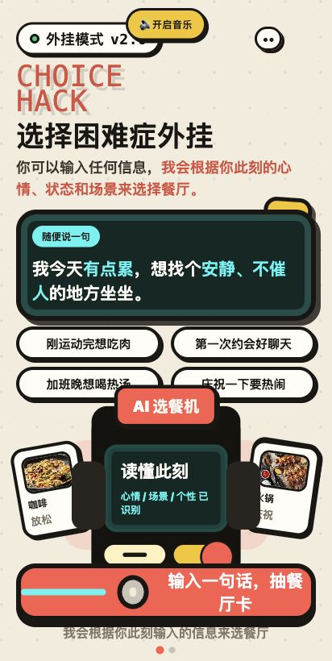
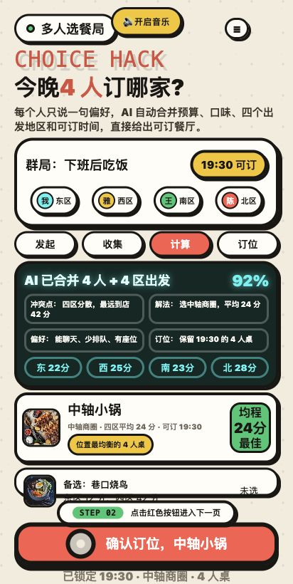
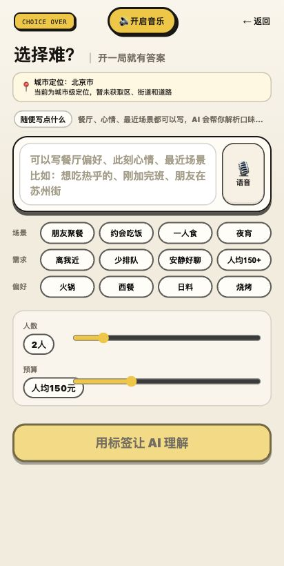
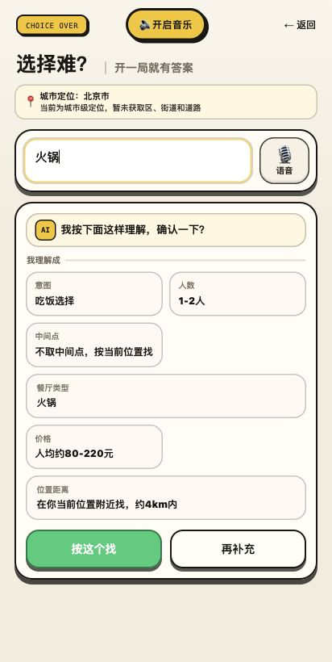
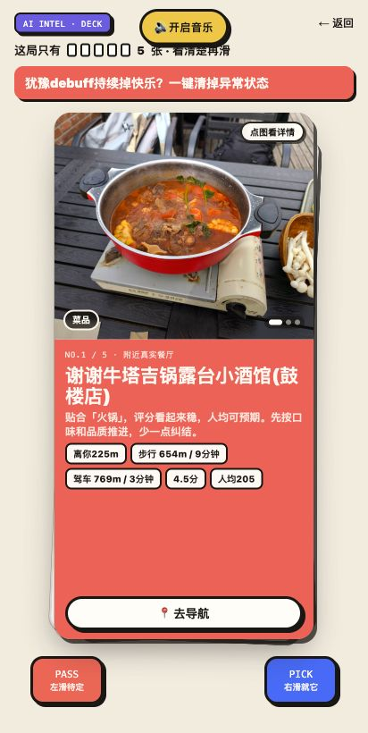
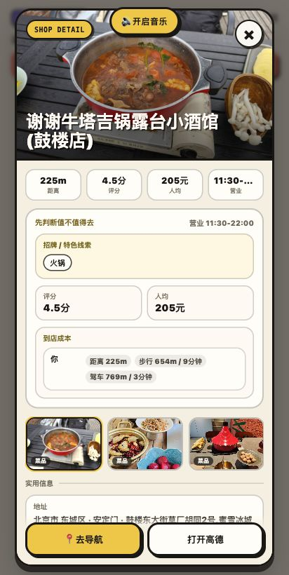

# 游戏版微信小程序页面截图记录

记录时间：2026-06-10 晚上

项目仓库：[hpuxyh/no-choice](https://github.com/hpuxyh/no-choice)

这份文档用于长期留存当前“游戏版微信小程序版本”的主要页面状态，后续如果要对照、恢复或继续优化，可以直接看下面的页面截图。

## 1. 封面：单人输入场景

## 2. 封面：多人选餐局

## 3. 输入页：此刻信息主卡

## 4. AI 确认页：理解结果可修改

## 5. 抽卡页：餐厅卡片

## 6. 餐厅详情页

